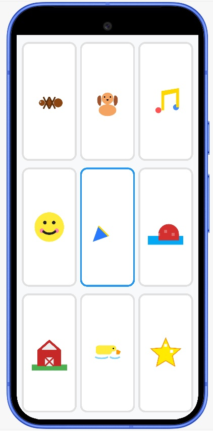

# Music Player for Kids 🎵

A simple, interactive, and child-safe soundboard designed for toddlers. This app provides a distraction-free environment where children can enjoy classic nursery rhymes through a purely visual and tactile interface.

## ✨ Features

- **Icon-Driven Interface**: A 3x3 grid of colorful, cute cartoon icons (Ant, Dog, Music Note, Happy Face, etc.) designed for pre-literate children.
- **Classic Nursery Rhymes**: Includes 9 beloved songs like *Twinkle Twinkle Little Star*, *Old MacDonald*, and *The Ants Go Marching*.
- **Interactive Looping**: Each song loops indefinitely once started, perfect for continuous play.
- **Intuitive Controls**: 
    - Tap an icon to start a song.
    - Tap the same icon again to stop it.
    - Tap a different icon to switch songs instantly.
- **Toddler-Proof Design**: 
    - **Immersive Mode**: Runs in full-screen to prevent accidental navigation away from the app.
    - **No Distractions**: No text, no progress bars, and no complex settings—just music.
- **Lightweight**: Uses high-quality MIDI files to keep the app size extremely small without sacrificing musicality.

## 🛠️ Technical Details

- **Language**: Kotlin
- **UI Framework**: Android XML with Material 3 Components.
- **Audio Engine**: Android `MediaPlayer` API.
- **Build System**: Gradle 9.5.0 with Android Gradle Plugin (AGP) 9.3.1.
- **Compatibility**: Supports Android 7.0 (API 24) and higher.

## 🚀 Getting Started

1. Clone the repository.
2. Open the project in **Android Studio Quail** (or later).
3. Build and run on a physical device or emulator.

## 📂 Project Structure

- `app/src/main/java/`: Contains the core logic in `MainActivity.kt`.
- `app/src/main/res/drawable/`: Custom-designed multi-colored kids' icons.
- `app/src/main/res/raw/`: The collection of 9 MIDI songs.
- `app/src/main/res/layout/`: The proportional 3x3 grid layout.

---
*Note: This app is optimized for children to explore music independently in a safe, controlled environment.*
